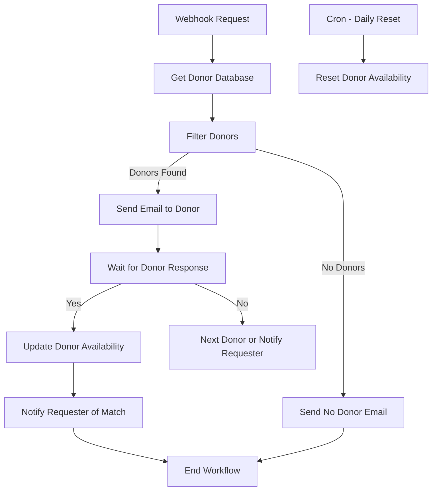

## 🩸 Donor Availability Workflow – n8n Automation  

## Overview  
The Donor Availability Workflow is an automation built in n8n to manage blood donor requests efficiently.
It connects Google Sheets and Gmail to automatically match donors, send emails, and update donor availability.

Whenever someone raises a blood request, this workflow filters eligible donors from a spreadsheet, contacts them via email, waits for their response, and then updates the database accordingly. If no donor is available, the requester receives an automatic notification.

**Workflow JSON:** https://github.com/ByreddyHarshita/abcd-agentic-training-vnr-Harshita/blob/main/Application/Donor%20Availability.json

---

## Objective

The main goal of this workflow is to remove manual effort from the donor-matching process.
It ensures that requests are handled instantly, donors receive proper notifications, and availability data stays up-to-date.

## How It Works

**1. Request Submission:** 

A requester submits a blood donation request through an API endpoint (/blood-request).

**2. Donor Search:**

The workflow fetches donor data from a Google Sheet and filters records based on blood group, city, and availability.

**3. Email to Donor:**

The matching donor receives an email from Gmail, with two response links:

“Yes, I can donate”

“Sorry, I’m not available”

**4. Waiting for Response:**

The workflow pauses and waits for the donor to respond for up to 10 minutes.

**5. Response Handling:**

If the donor accepts, the requester is notified that a match was found.

If the donor rejects, the system automatically contacts the next eligible donor.

If no donors are found, the requester receives an email saying that no donors are currently available.

**6. Automatic Updates:**

The donor’s availability is updated in Google Sheets. Once they respond, they are marked as “Not Available”.

**7. Daily Reset:**

A daily Cron job runs in the background. It checks all donors who were marked unavailable and resets them to “Available” automatically after 30 days.

---

## Workflow Components  

| Node | Type | Description |
|------|------|-------------|
| **Request Webhook** | Webhook | Triggers the workflow when a new donor request is received. |
| **Workflow Configuration** | Set | Configures sheet names, spreadsheet ID, and timeouts. |
| **Get Donor Database** | Google Sheets | Fetches all donor records. |
| **Filter Donors** | Code | Filters donors by city, blood group, and availability. |
| **Check If Donors Found** | If | Decides whether to proceed or send a “No Donors” email. |
| **Send Email to Donor** | Gmail | Sends donor request email with “Yes/No” links. |
| **Wait** | Wait (Webhook) | Waits for donor response for up to 10 minutes. |
| **Check If Accepted** | If | Branches logic based on donor response. |
| **Update Donor Availability** | Google Sheets | Marks donor “Unavailable” once accepted or rejected. |
| **Notify Requester of Match** | Gmail | Informs requester that a donor has accepted. |
| **Cron - Daily Reset** | Cron Trigger | Resets donor availability if 30+ days since last update. |

---

## Data Used

The workflow connects to two Google Sheets:

**Donors Sheet**

| Name | Blood Group | Email | City | Available | Last Updated |

This sheet keeps track of all registered donors and their availability status.

**Requests Sheet**

| Request ID | Donor Name | Donor Email | Blood Type | Requester Name | Requester Email |

This sheet records every incoming request and which donor was contacted for it.

---

## Email Notifications

**Donor Notification:**

The donor receives an email with details about the requester and two quick-response buttons.
Clicking “Yes” or “No” updates the workflow instantly.

**Requester Notification:**

If a donor accepts, the requester is informed that a match has been found.
If no donors are available, they receive an update that no one is currently free to donate.

---

## Daily Reset Logic

A scheduled job runs every night at midnight.
It checks the “Last Updated” date in the Donors Sheet.
If a donor has been marked unavailable for more than 30 days, their status is changed back to “Available” automatically.

---

## Setup Instructions

1. **Import** `Donor Availability.json` into your **n8n** instance.
2. **Connect Credentials:**

   * `Google Sheets OAuth2` (for donor data)
   * `Gmail OAuth2` (for notifications)
3. **Edit Configurations** in the `Workflow Configuration` node:

   * Spreadsheet ID
   * Sheet names (`Donors`, `Requests`)
   * Timeout duration if needed
4. **Activate the Workflow.**
5. Send a test request to the **Webhook URL** (`/blood-request`) with fields like:

   ```json
   {
     "RequesterName": "Geeta",
     "RequesterEmail": "geeta@example.com",
     "bloodgroup": "A+",
     "city": "Hyderabad"
   }
   ```
6. Monitor donor activity directly on your linked Google Sheets.


---

## Workflow Visualization



---

## Tech Stack

| Component                  | Purpose                              |
| -------------------------- | ------------------------------------ |
| **n8n**                    | Workflow automation engine           |
| **Google Sheets API**      | Donor database management            |
| **Gmail API**              | Automated email communication        |
| **JavaScript (Code Node)** | Filtering logic and donor sequencing |
| **Cron Node**              | Time-based reactivation system       |

---

## Future Improvements

- Integration with WhatsApp or SMS APIs for faster donor communication.

- Adding a dashboard to visualize active requests and donor trends.

- Introducing donor prioritization for urgent cases.

## References

- Workflow JSON: https://github.com/ByreddyHarshita/abcd-agentic-training-vnr-Harshita/blob/main/Application/Donor%20Availability.json
- Workflow Demo:
  
  **1.** https://github.com/ByreddyHarshita/abcd-agentic-training-vnr-Harshita/blob/main/Application/Donor%20Availability_1.mp4

  **2.** https://github.com/ByreddyHarshita/abcd-agentic-training-vnr-Harshita/blob/main/Application/Donor%20Availability_2.mp4
- PPT Link: https://github.com/ByreddyHarshita/abcd-agentic-training-vnr-Harshita/blob/main/Application/Automated%20Blood%20Donor%20Availability.pptx
---
